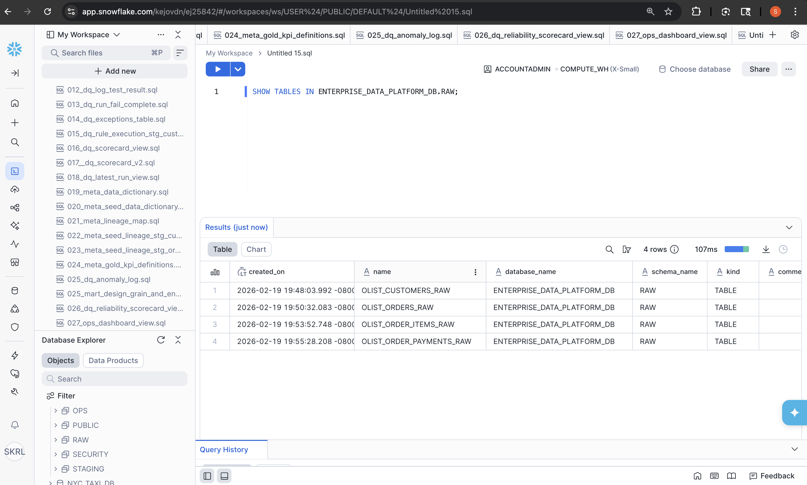
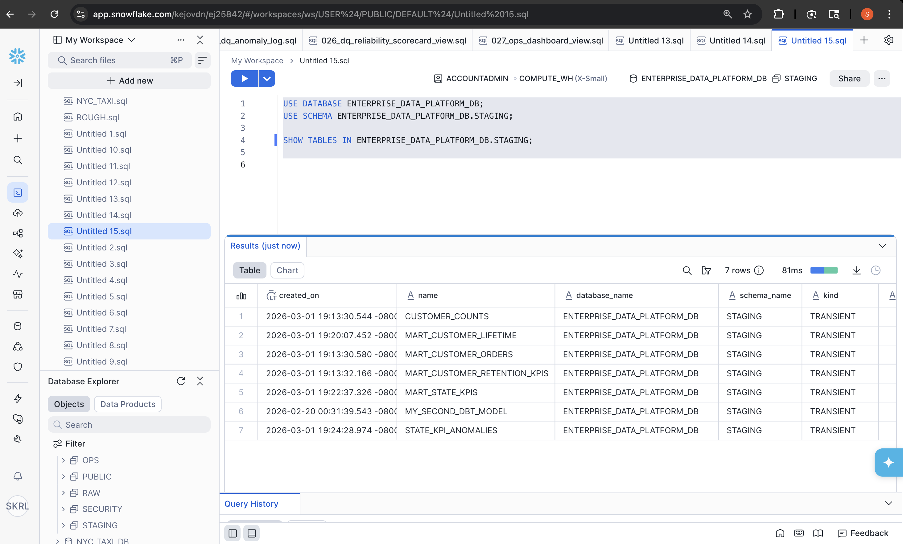
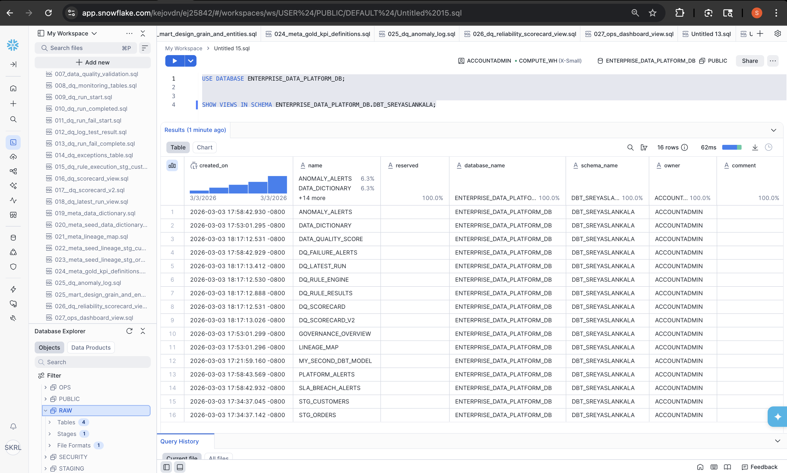
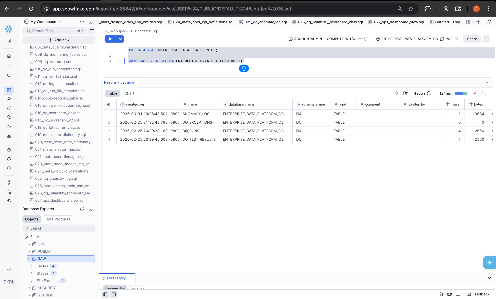
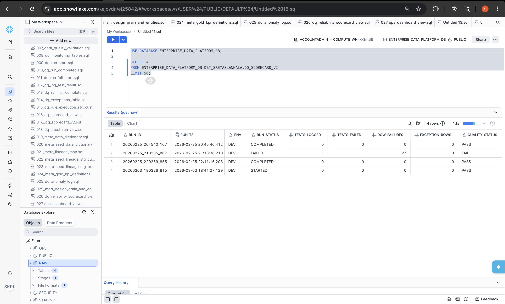
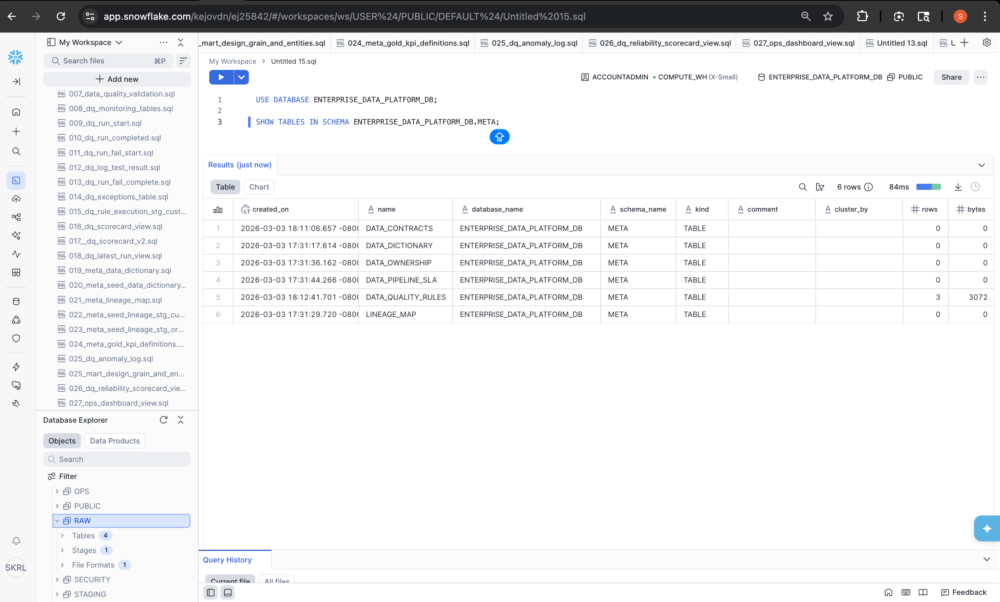
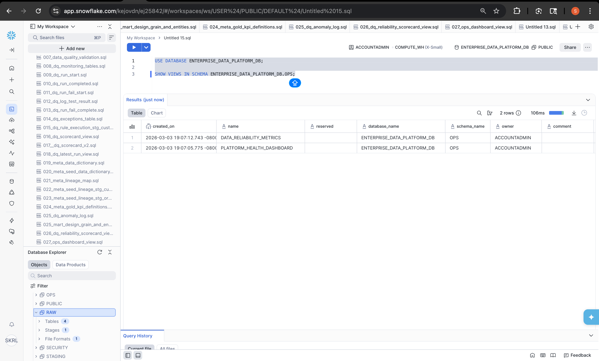
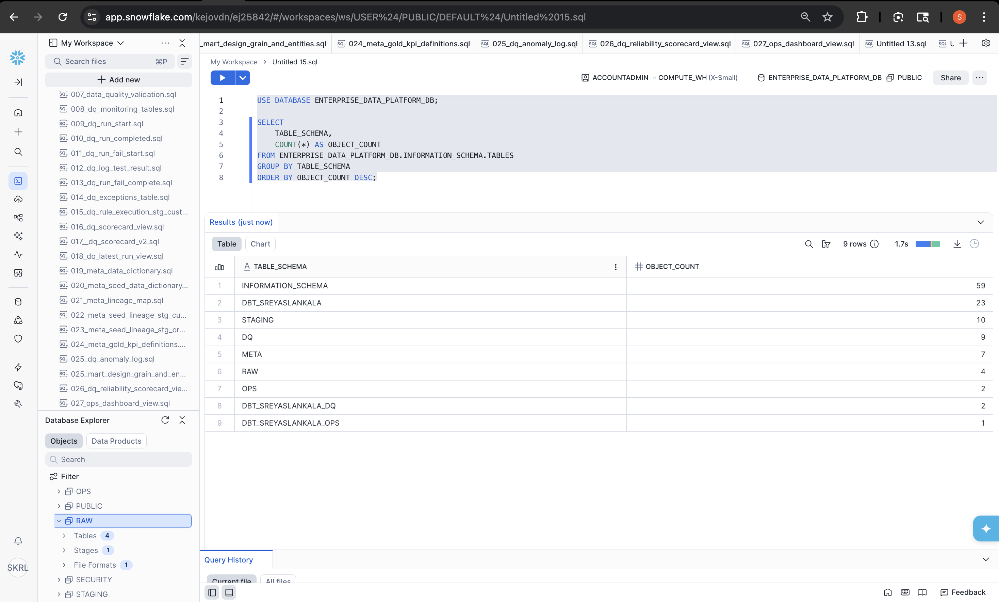

# Enterprise Data Quality & Governance Platform


Snowflake • dbt • Data Quality • Metadata Governance • Data Reliability

---

# Overview

This project demonstrates a **modern enterprise data platform architecture** built on **Snowflake and dbt** with integrated **data quality monitoring, metadata governance, lineage tracking, and reliability monitoring**.

The platform simulates how organizations ensure **trusted, governed, and reliable data** across analytical systems.

The design follows a **layered architecture used by modern enterprise data engineering teams**.

---

# Architecture Overview

The platform follows a modern layered architecture:

```
Source Data
   ↓
RAW Layer
   ↓
STAGING Layer
   ↓
dbt Transformations
   ↓
Analytics / Data Marts
```

Supporting platform layers:

```
Data Quality Framework
Metadata Governance
Reliability Monitoring
```

---

# Platform Execution Flow

The platform simulates how enterprise pipelines are executed end-to-end.

Execution flow:

1. Load source datasets into the **RAW schema**
2. Standardize and clean data in the **STAGING schema**
3. Execute **dbt transformation models**
4. Run **data quality validation rules**
5. Generate **data quality scorecards**
6. Update **metadata governance tables**
7. Refresh **monitoring dashboards and SLA alerts**

Execution pattern:

```
RAW → STAGING → dbt Models → Data Quality Checks → Metadata Governance → Monitoring
```

---

# Platform Schemas

The platform is organized into logical schemas representing each layer.

| Schema | Purpose |
|------|------|
| RAW | Raw ingestion layer |
| STAGING | Data standardization layer |
| DBT_SREYASLANKALA | dbt transformation models |
| DQ | Data quality monitoring framework |
| META | Metadata governance layer |
| OPS | Monitoring and reliability metrics |

---

# Data Ingestion Layer

Raw source datasets are loaded into the **RAW schema** without transformation.

This preserves the original structure of the source data.



Example datasets:

- customers
- orders
- order_items
- payments

---

# Transformation Layer

Data is standardized and cleaned in the **STAGING schema**.

This layer prepares datasets for transformation and analytical modeling.



Examples include:

- standardized customer data
- normalized order records
- cleaned transaction datasets

---

# dbt Transformation Models

The **dbt layer** builds analytics-ready datasets used for reporting and monitoring.



Example models:

- customer metrics
- order aggregations
- retention KPIs
- anomaly detection datasets

dbt provides:

- modular SQL transformations
- dependency management
- automated testing
- reproducible pipelines

---

# Data Quality Framework

A dedicated **Data Quality framework** validates datasets across the platform.



Core components:

- rule execution engine
- anomaly detection
- exception tracking
- validation result logging

This ensures datasets meet **expected quality standards before downstream consumption**.

---

# Data Quality Scorecards

The platform produces automated **data reliability scorecards**.



Scorecards track:

- tests executed
- failed tests
- row-level failures
- exception counts
- pipeline run status

These metrics help teams monitor **data reliability and pipeline health**.

---

# Metadata Governance Layer

The **META schema** manages governance and documentation.



Key governance components:

- data dictionary
- dataset ownership
- lineage mapping
- data contracts
- SLA definitions

This layer enables **data transparency and governance enforcement**.

---

# Platform Monitoring

Operational monitoring is implemented through the **OPS schema**.



Monitoring features:

- pipeline health metrics
- reliability scorecards
- anomaly detection
- SLA breach alerts

This enables proactive monitoring of **data platform health**.

---

# Platform Object Distribution

The following view summarizes the distribution of platform objects across layers.



This illustrates how ingestion, transformation, governance, and monitoring components are structured across schemas.

---

# Data Lineage Example

The platform simulates lineage tracking between datasets.

Example lineage:

```
RAW_CUSTOMERS
      ↓
STAGING_CUSTOMERS
      ↓
DBT_CUSTOMER_METRICS
      ↓
DQ_SCORECARD
      ↓
OPS_MONITORING_VIEWS
```

Lineage tracking allows teams to:

- trace data origins
- diagnose upstream failures
- enforce data contracts
- monitor dataset dependencies

---

# Platform Capabilities

The platform demonstrates key capabilities found in enterprise data systems.

| Capability | Implementation |
|------|------|
| Data Ingestion | RAW schema |
| Data Transformation | dbt models |
| Data Quality Validation | SQL rule engine |
| Metadata Governance | META schema |
| Data Dictionary | metadata tables |
| Data Lineage | lineage mapping |
| Data Contracts | governance rules |
| Reliability Monitoring | OPS schema views |
| SLA Monitoring | alert views |
| Anomaly Detection | monitoring queries |

---

# Pipeline Execution Script

The repository includes a script simulating **end-to-end platform execution**.

```
sql_platform/000_run_full_platform.sql
```

This script orchestrates:

- ingestion processes
- transformation steps
- data quality validation
- governance updates
- monitoring refresh queries

This reflects how enterprise pipelines maintain **repeatable and auditable execution workflows**.

---

# Example Data Quality Checks

The platform includes automated checks such as:

- null value validation
- duplicate record detection
- referential integrity checks
- business rule validation
- KPI anomaly detection

These checks ensure analytical datasets meet **expected quality thresholds**.

---

# Technology Stack

| Technology | Purpose |
|------|------|
| Snowflake | Data warehouse |
| dbt | Data transformations |
| SQL | Data modeling |
| GitHub | Version control |
| Data Quality Framework | Validation and monitoring |

---

# Repository Structure

```
enterprise-data-platform
│
├── architecture
│   ├── enterprise_data_platform_architecture.png
│   └── platform_architecture.mmd
│
├── docs
│   └── governance_framework.md
│
├── edp_dbt
│   ├── models
│   ├── macros
│   ├── tests
│   └── dbt_project.yml
│
├── sql_platform
│   └── 000_run_full_platform.sql
│
├── screenshots
│   ├── 01_raw_layer_tables.png
│   ├── 02_staging_layer_tables.png
│   ├── 03_dbt_models.png
│   ├── 04_dq_tables.png
│   ├── 05_dq_scorecard_results.png
│   ├── 06_metadata_tables.png
│   ├── 07_ops_monitoring_views.png
│   └── 08_platform_layer_summary.png
│
└── README.md
```

---

# Future Enhancements

Potential improvements include:

- integration with data catalogs (Collibra / Alation)
- automated lineage visualization
- CI/CD data pipeline testing
- alerting pipelines
- observability dashboards
- data contract enforcement automation

---

# Author

Sreyas Lankala

Data Quality • Governance • Metadata • Data Reliability

LinkedIn  
https://www.linkedin.com/in/sreyas-lankala/

GitHub  
https://github.com/sreyas-lankala