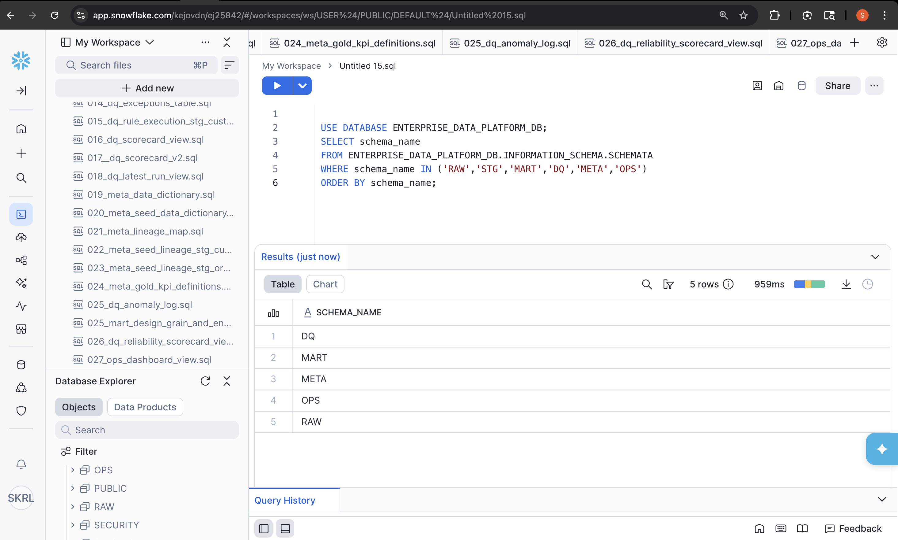

# Enterprise Data Quality & Governance Platform

Snowflake • dbt • Data Quality • Metadata Governance • Data Reliability • Data Observability


---

# Overview

This project demonstrates a **modern enterprise data platform architecture** built using **Snowflake and dbt** with integrated:

• Data Quality Monitoring  
• Metadata Governance  
• Data Contracts  
• Data Lineage  
• Data Reliability Monitoring  
• Operational Observability  
• Pipeline Orchestration  
• CI/CD Automation  

The platform simulates how organizations build **trusted data systems** where pipelines are governed, monitored, and validated to ensure reliable analytics.

The architecture follows a **layered enterprise data platform design pattern** commonly used in modern analytics environments.

---

# Platform Architecture

The platform follows a **layered data architecture**.

```
Source Systems
      ↓
RAW Layer
      ↓
STAGING Layer
      ↓
MART Layer
```

Supporting platform capabilities:

```
Data Quality Framework
Metadata Governance
Data Contracts
Reliability Monitoring
Operational Observability
Pipeline Orchestration
CI/CD Automation
```

This design enables:

• trusted analytical datasets  
• traceable lineage across transformations  
• enforceable governance rules  
• automated validation and monitoring  

---

# 🚀 Platform Execution

The platform can be executed end-to-end using the SQL scripts provided in the repository.

This simulates how enterprise data teams orchestrate:

• data ingestion  
• transformation pipelines  
• validation frameworks  
• governance metadata  
• operational monitoring  

---

## Step 1 — Create Platform Infrastructure

Run:

```sql
sql_platform/01_platform_setup/001_create_platform.sql
```

This script creates the Snowflake platform environment.

Schemas created:

- RAW
- STAGING
- MART
- DQ
- META
- OPS

---

## Step 2 — Create RAW Data Layer

Execute:

```sql
sql_platform/02_raw_layer/004_create_raw_tables.sql
sql_platform/02_raw_layer/005_load_raw_data.sql
```

This loads source datasets into the **RAW schema**.

Example datasets:

- customers
- orders
- order_items
- payments
- sellers

The RAW layer preserves **source-of-truth data without transformation**.

---

## Step 3 — Run STAGING Transformations

Execute:

```sql
sql_platform/03_staging_layer/006_stg_customers_validation.sql
```

The staging layer performs:

• schema normalization  
• column standardization  
• basic validation rules  
• transformation preparation  

---

## Step 4 — Execute dbt Models

Run dbt transformations:

```bash
cd edp_dbt
dbt run
```

dbt produces analytics-ready datasets in the **MART schema**.

Capabilities include:

• modular SQL transformations  
• dependency management  
• lineage tracking  
• reproducible pipelines  

---

## Step 5 — Run Data Quality Framework

Execute:

```sql
sql_platform/04_data_quality/007_data_quality_validation.sql
sql_platform/04_data_quality/036_data_quality_rule_engine.sql
```

The framework executes automated validation rules and logs failures.

---

## Step 6 — Populate Metadata Governance Layer

Execute scripts in:

```
sql_platform/05_metadata/
```

This builds governance metadata including:

• data dictionary  
• data ownership  
• lineage mapping  
• data contracts  
• pipeline SLA tracking  

---

## Step 7 — Run Monitoring Layer

Execute monitoring views in:

```
sql_platform/07_monitoring/
```

These views provide operational monitoring metrics.

---

## Optional — Execute Full Platform

Run:

```sql
sql_platform/000_run_full_platform.sql
```

Execution flow:

```
RAW → STAGING → dbt → Data Quality → Metadata Governance → Monitoring
```

---

# Pipeline Orchestration

The platform supports automated orchestration using **Apache Airflow**.

Airflow manages execution across ingestion, transformation, validation, governance updates, and monitoring.

Pipeline flow:

```
RAW Ingestion
      ↓
STAGING Transformations
      ↓
dbt Model Execution
      ↓
Data Quality Validation
      ↓
Metadata Governance Updates
      ↓
Observability Monitoring
```

Example orchestration DAG:

```
orchestration/airflow_data_platform_dag.py
```

This demonstrates how the platform could be scheduled in a production environment.

---

# CI/CD Pipeline

The repository includes a **GitHub Actions CI workflow**.

Workflow file:

```
.github/workflows/data_platform_ci.yml
```

The CI pipeline validates the platform whenever code is pushed.

CI pipeline steps:

• repository checkout  
• environment setup  
• dbt installation  
• project structure validation  
• SQL script checks  

This ensures reproducible platform deployments.

---

# Platform Schemas

| Schema | Purpose |
|------|------|
| RAW | Raw ingestion layer |
| STAGING | Data normalization |
| MART | Analytics-ready datasets |
| DQ | Data quality monitoring |
| META | Metadata governance |
| OPS | Platform observability |

---

# Snowflake Platform Schemas



---

# Data Ingestion Layer

Source datasets are loaded into the **RAW schema**.


Example tables:

- customers
- orders
- order_items
- payments

---

# Transformation Layer

The **STAGING schema** prepares datasets for analytical modeling.


Responsibilities include:

• schema normalization  
• field standardization  
• transformation preparation  

---

# Analytical Models (dbt)

dbt models generate analytics-ready datasets in the **MART schema**.


Example models:

- customer lifetime metrics
- order aggregates
- retention KPIs
- anomaly detection datasets

---

# Data Quality Framework

A dedicated **DQ schema** manages validation and monitoring.


Framework components include:

• rule execution engine  
• exception tracking  
• anomaly logging  
• validation result storage  

---

# Metadata-Driven Data Quality Rules

The platform implements a **metadata-driven data quality rule engine**.

Example validations include:

• NOT NULL validation  
• duplicate detection  
• business rule enforcement  


---

# Data Quality Scorecards

Automated **reliability scorecards** monitor pipeline health.


Metrics tracked:

• tests executed  
• failed tests  
• exception counts  
• pipeline run status  

---

# Metadata Governance Layer

The **META schema** stores governance metadata.


| Table | Purpose |
|------|------|
| DATA_DICTIONARY | Business definitions |
| DATA_OWNERSHIP | Data ownership |
| LINEAGE_MAP | Dataset lineage |
| DATA_CONTRACTS | Schema validation |
| DATA_PIPELINE_SLA | SLA monitoring |
| DATA_QUALITY_RULES | Validation rules |

---

# Platform Monitoring

Operational monitoring is implemented in the **OPS schema**.


Capabilities include:

• pipeline health monitoring  
• SLA breach detection  
• anomaly alerts  
• reliability metrics  

---

# Data Lineage Example

```
RAW_CUSTOMERS
      ↓
STAGING_CUSTOMERS
      ↓
MART_CUSTOMER_METRICS
      ↓
DQ_SCORECARD
      ↓
OPS_MONITORING_VIEWS
```

Lineage tracking enables:

• traceability  
• root cause analysis  
• governance enforcement  

---

# Platform Metrics

| Component | Count |
|------|------|
| Snowflake Schemas | 6 |
| SQL Scripts | 40+ |
| dbt Models | 25+ |
| Governance Tables | 6 |
| Monitoring Views | 10+ |
| Data Quality Rules | 65+ |

---

# Technology Stack

| Technology | Purpose |
|------|------|
| Snowflake | Data warehouse |
| dbt | Transformations |
| SQL | Data modeling |Python
| GitHub | Version control |
| Apache Airflow | Pipeline orchestration |
| GitHub Actions | CI/CD automation |

---

# Repository Structure

```
enterprise-data-platform
│
├── architecture
│   ├── enterprise_data_platform_architecture.png
│   └── platform_architecture.mmd
│
├── orchestration
│   └── airflow_data_platform_dag.py
│
├── docs
│   └── governance_framework.md
│
├── edp_dbt
│   ├── models
│   ├── macros
│   ├── tests
│   └── dbt_project.yml
│
├── sql_platform
│   └── 000_run_full_platform.sql
│
├── screenshots
│   ├── 01_raw_layer_tables.png
│   ├── 02_staging_layer_tables.png
│   ├── 03_dbt_models.png
│   ├── 04_dq_tables.png
│   ├── 05_dq_scorecard_results.png
│   ├── 06_metadata_tables.png
│   ├── 07_ops_monitoring_views.png
│   └── 08_platform_layer_summary.png
│
└── .github/workflows
    └── data_platform_ci.yml
```

---

# Target Roles

This project demonstrates skills relevant to:

• Data Quality Engineer  
• Data Governance Engineer  
• Metadata Engineer  
• Analytics Engineer  
• Data Platform Engineer  
• Data Reliability Engineer

---

# Author

Sreyas Lankala  

Data Quality • Governance • Metadata • Data Reliability  

LinkedIn  
https://www.linkedin.com/in/sreyas-lankala/

GitHub  

https://github.com/sreyas-lankala
